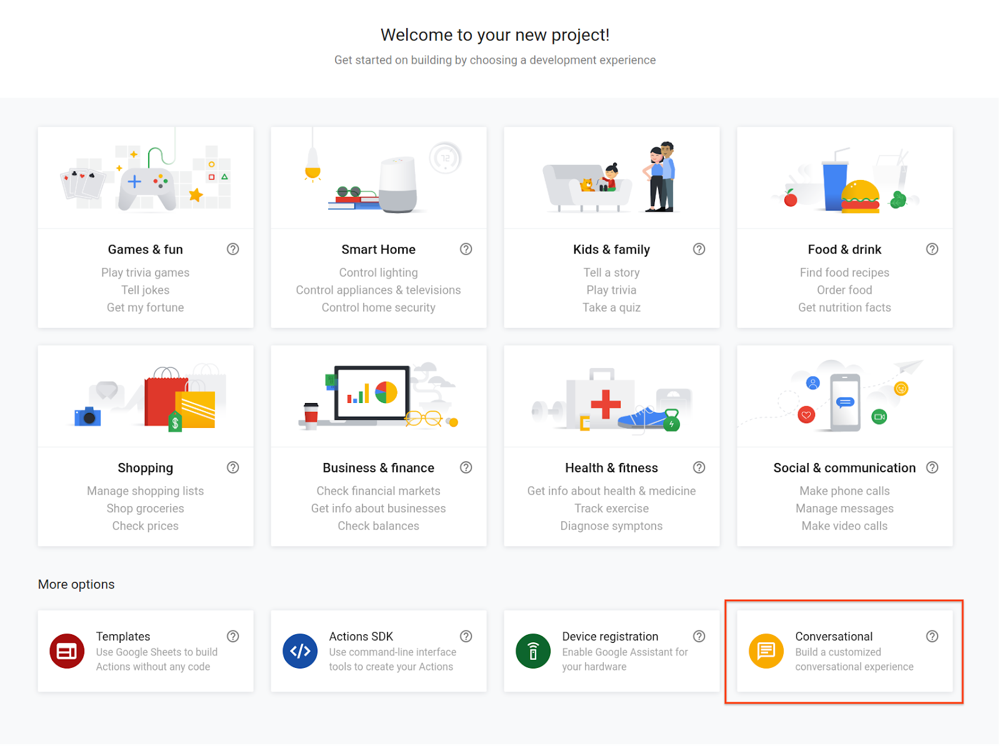
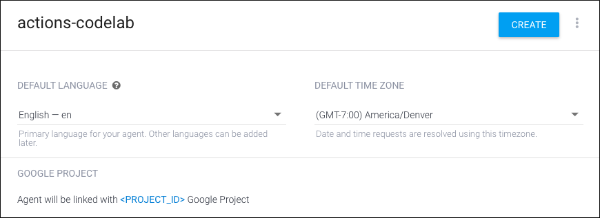
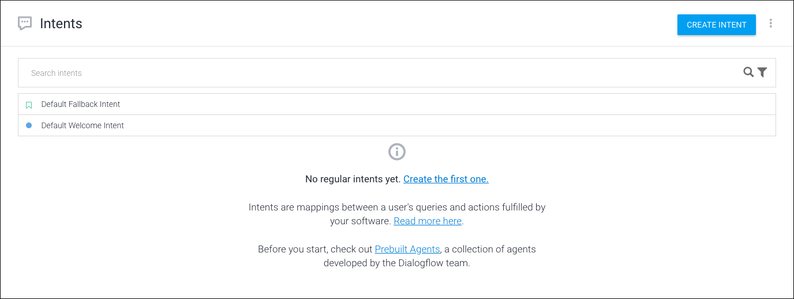
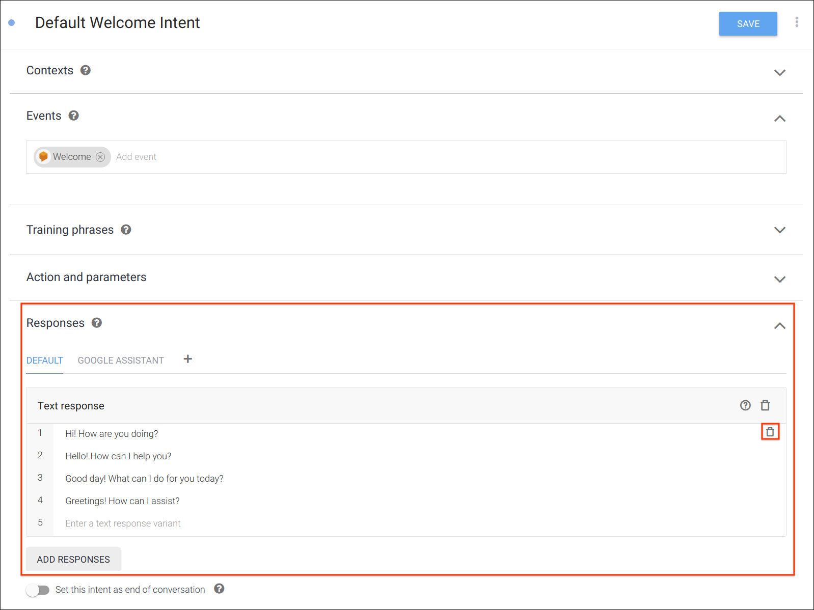
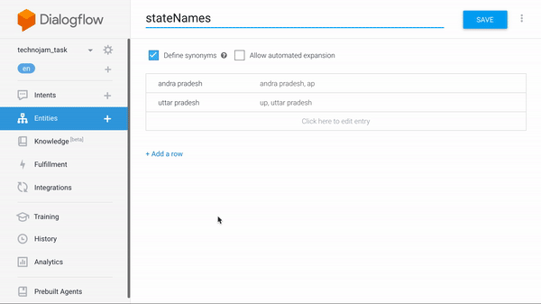

# TASK 1
### Step 1: Initialize project

- Open the Actions Console.
- Click New project.
- Type in a Project name, like "technojam-task". This name is for your own internal reference; later on, you can set an external name for your project.

- Click Create Project.
- Rather than pick a category, scroll down to the More options section and click on the Conversational card.

- Click Build your Action to expand the options and select Add Action(s).
Click Add your first action.
On the Create Action dialog, select Custom Intent and click Build. This will open the Dialogflow Console in another tab.

- Create a Dialogflow agent
Now that you've built your Actions project, create a Dialogflow agent and associate it with your project:

- If using Google Chrome and signed into more than one account, ensure that you are using the same account across consoles.

- After following the steps above, you should already be in the Dialogflow Console with your Actions project name at the top. You may need to authorize Dialogflow to use your Google account, and accept the Terms of Service.

- Click Create.

### Step 2: Starting a conversation
#### Create a welcome intent
###### Every Actions project must have a welcome intent that acts as an entry point for users to start conversations. The welcome intent is triggered when users explicitly invoke an Action by uttering its name.

###### By default, Dialogflow creates a welcome intent for us. For this codelab, you'll modify the welcome intent that users trigger when they say "Hey Google, talk to my test app".

##### To modify the welcome intent:

- In the Intents page of the Dialogflow Console, click on Default Welcome Intent.

- Delete all of the other text responses by clicking the trash icon next to each one.

- Under the Responses section, click Enter a text response and type "Welcome! Which state capital you want to know about?"
- Click Save. You should see a "Intent saved" notification briefly pop up.

#### Create An entity called "stateNames"
- Click on + icon in front of entities
- Type name of entity. For example "statesName"
- Type two states name for example "uttar pradesh" and "andra pradesh"
- click on save

#### Create "capital" intent
- Go to intent and click on create intent
- Type name of intent "capital"
- #### Add training phrases like:
1. "capital of up"
2. "tell me capital of up"
3. "can you tell me capital of ap"
4. "up"
5. "what is the capital of uttar pradesh"
- Save

### Step 3: Enable Fulfilment
- Scroll down and click on fufilment
- click on enable fulfilment
- Enable both check boxes.
- Go to Fulfilment tab on the left

### Go to task two
___
___
